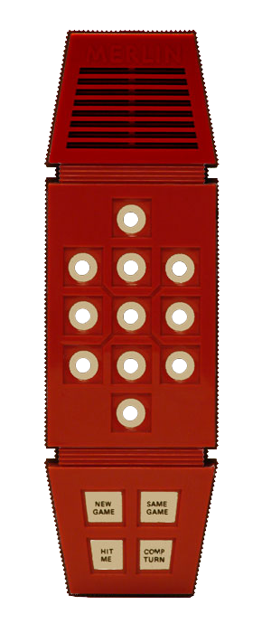

# lets-go-merlin

A faithful emulator of **Merlin — The Electronic Wizard** (Parker
Brothers, 1978), running the **original Texas Instruments MP3404 ROM**
on a from-scratch **TMS1100** interpreter written in Go. The same core
runs three ways: a browser build (Go → WebAssembly, audio via an
AudioWorklet), a CLI for tracing/debugging, and — as a pure, dependency-
free package — anywhere Go runs.

Nothing here re-creates Merlin's six games. The 1978 program is executed
one instruction at a time; the light-show, the tones and all six games
*emerge* from running the real chip's code. The interpreter is verified
**bit-for-bit** against a C++ reference across 200,000 instructions.

<p align="center">
  
</p>

## Play

Live (GitHub Pages): **https://carledwards.github.io/lets-go-merlin/**

Press **Power On**, then click a game in the side panel (it does
*New Game → number* for you), or play the device directly — the 11 lit
pads and the New/Same/Hit/Comp buttons on the faceplate are all live.

## Quickstart

```bash
make test     # full suite incl. the 5000-line CPU golden trace
make serve    # build wasm + serve at http://localhost:8080
make cli      # watch the matrix scan in the terminal
```

## Browser build / GitHub Pages

```bash
make wasm     # builds web/merlin.wasm (+ copies wasm_exec.js)
```

`web/` is a self-contained static site (no SharedArrayBuffer, no
COOP/COEP). `.github/workflows/wasm-pages.yml` rebuilds the wasm and
deploys `web/` to GitHub Pages on every push to `main`; it self-enables
Pages on first run.

## How it works

Short version: a pure TMS1100 interpreter (`pkg/tms1100`) executes the
embedded ROM; a thin Merlin wrapper (`pkg/merlin`) decodes the R/O/K
matrix into 11 LEDs and the buttons, taps the speaker line, and a
resampler (`pkg/audio`) turns the ~58 kHz 1-bit speaker stream into
browser audio. Full design, the matrix mapping, the audio pacing
decision and the verification method: **[docs/architecture.md](docs/architecture.md)**.

## Project layout

```
cmd/merlinweb     Go→WASM browser front-end (syscall/js)
cmd/merlincli     CLI: instruction trace / matrix-scan view
cmd/merlinserve   tiny static server (correct .wasm MIME)
pkg/tms1100       pure TMS1100 interpreter (no I/O, no deps)
pkg/merlin        Merlin wrapper: matrix, LED decay, speaker
pkg/audio         1-bit speaker → PCM resampler
roms              embedded MP3404 ROM (2 KB)
web               static site: index.html, main.js, worklet.js
internal/tools    ledscan / btnscan — derive UI coords from the art
docs              architecture.md + images
```

## Verification

`pkg/tms1100` is diffed instruction-for-instruction against the C++
reference (`carledwards/merlin-tms1100`): **200,000 / 200,000
byte-identical**. `make ref-verify` re-runs the live diff (needs
`clang++`); a CI-safe golden trace is checked into
`pkg/tms1100/testdata`. `go test ./...` covers the core, the matrix
wrapper and the resampler.

## Credits & provenance

- **Bob Doyle** — designed Merlin (Parker Brothers, 1978). The faceplate
  artwork is derived from his site
  [theelectronicwizard.com](https://www.theelectronicwizard.com/);
  rights remain with the original author.
- **Dominic Thibodeau (hotkeysoft)** — the original C++ TMS1000-family
  emulator this lineage descends from.
- **Carl Edwards** —
  [`merlin-tms1100`](https://github.com/carledwards/merlin-tms1100),
  the C++/Python port used as the bit-exact reference spec.
- **The MAME team** — `hh_tms1k.cpp`, source of the definitive Merlin
  R/O/K matrix wiring and ROM identification (MAME is GPL-2.0; only the
  factual wiring was used — no MAME code is included here).
- **Texas Instruments / Parker Brothers** — the TMS1100 and the MP3404
  ROM (`roms/mp3404.bin`), © 1978. Included for emulation and
  preservation (the same dump MAME uses); copyright is retained by its
  owners and it is **not** covered by this repo's license.

## License

MIT (original code only) — see [LICENSE](LICENSE). The embedded ROM and
the derived faceplate art are third-party material under their own
rights, as noted above and in the LICENSE file.
