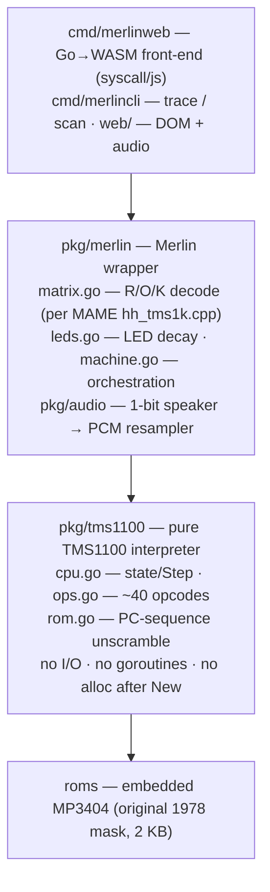
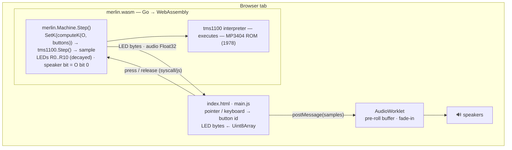

# Architecture

How the pieces fit. The whole point: run the **original 1978 Merlin
program**, not a re-creation of its games.

## What Merlin is

Parker Brothers *Merlin* (1978), designed by Bob Doyle. Its processor is
a Texas Instruments **TMS1100** (mask part **MP3404**) — a member of the
**TMS1000 series**, one of the first single-chip microcontrollers (TI,
1974), itself a generalization of TI's calculator-on-a-chip silicon. The
same family ran Simon, Big Trak, TI calculators and Speak & Spell. A
whole computer — CPU + mask ROM + RAM + I/O — for pennies, which is what
made the late-70s electronic-game boom possible.

TMS1100 traits the emulator must respect: 4-bit, ~350 kHz RC clock
(~58k instr/s), Harvard, no interrupts/timers/DMA, one-deep call stack,
and a program counter that advances in a scrambled LFSR order.

## Layering

The core is platform-agnostic and side-effect free. The host **polls**
CPU state after each `Step()` and sets K (inputs) before each `Step()` —
no callbacks.

## Runtime data flow (browser)

rAF loop: each frame runs ≈ `elapsed × 58 kHz × speed` instructions —
real wall-clock pacing; the jitter cushion lives in the AudioWorklet.

Mapping (from MAME `hh_tms1k.cpp` + the trusted `merlin_console.py`):
LEDs = R0..R10 direct; speaker = `O & 0x01`; input columns O ∈ {0,4,8,12},
K bits per pad/button.

## Audio

Merlin has no sound chip. The ROM toggles one output pin in timing
loops; pitch = loop speed, rhythm = loop count. We don't synthesize: every
instruction we sample that pin (`O & 1`) and resample the ~58 kHz 1-bit
stream to the audio context rate via fractional accumulation
(`pkg/audio`), drained by an AudioWorklet. Faithful CPU timing ⇒ correct
pitch for free; clock tuning shifts pitch like a weak battery.

Pacing decision: the WASM emulator runs at **real wall-clock time**
(fractional-instruction carry, no drift). It deliberately does *not*
steer on its own sampler — that buffer is drained every frame, so it
always reads empty and the emulator races. All jitter tolerance lives
in the **AudioWorklet**: a pre-roll cushion before (re)start, a short
fade-in (no startup pop), and hold-and-decay on underrun. Knob:
`PREROLL` in `web/worklet.js`.

## Verification

`pkg/tms1100` is diffed instruction-for-instruction against the C++
reference (`carledwards/merlin-tms1100`): **200,000/200,000 byte-identical**.
Regression: `make ref-verify` (needs clang++); CI-safe golden trace in
`pkg/tms1100/testdata`. See `go test ./...`.

## Credits

- **Bob Doyle** — designed Merlin (Parker Brothers, 1978); faceplate art
  derived from theelectronicwizard.com.
- **Dominic Thibodeau (hotkeysoft)** — original C++ TMS1000-family emulator.
- **Carl Edwards** — `merlin-tms1100` C++/Python reference port.
- **MAME team** — `hh_tms1k.cpp` matrix wiring + ROM identification.
- **Texas Instruments / Parker Brothers** — TMS1100 + MP3404 ROM (© 1978).
